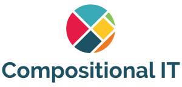
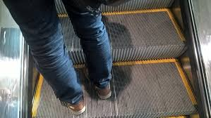
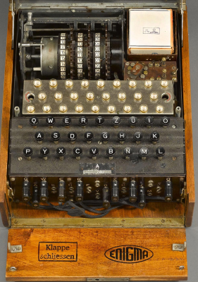
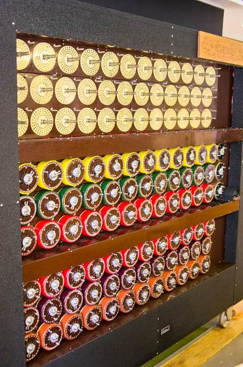

- title : Demystifying the Enigma
- description : Turning yet another domain into something about F#
- author : Isaac Abraham
- theme : night
- transition : default

***

#Demystifying the Enigma

##Isaac Abraham



---

##Who am I?


### Isaac Abraham!

---



---

* .NET dev / contractor / consultant since .NET 1.0
* Director of Compositional IT
* F# developer since 2012
* Microsoft MVP in F# / .NET
* Based in Hessen & London


---

* email *[isaac@compositional-it.com](mailto:isaac@compositional-it.com)*
* twitter *[@isaac_abraham](https://twitter.com/isaac_abraham)*
* web *http://compositional-it.com*
* blog *http://cockneycoder.wordpress.com*

***

## What was the Enigma?



* A cipher machine
* Used during WW2
* *Commercially* available since 1920s
* **Not** invented by the Nazis!

---

## What was its role in WW2?

* Used by the Axis powers during WW2
* Various modifications made by the Nazis during WW2
* Used for majority of radio traffic throughout the war
* Cracked by British Secret Service in Bletchley Park

---

## How did it work?

* A set of five substitution cyphers in one
* Translates one letter at a time to a different letter
* Each translated letter alters the configuration for the next letter 

---

## The components of Enigma

* **Plugboard**: a configurable substitution between two letters
* **Rotors**: a fixed substitution between two letters
* **Reflector**: a fixed substitution between two letters


---

You type in 'A'

| Stage | Input | Output |
|---|---|---|
| Plugboard | A | Z |
| Rotor | Z | F
| Reflector | F | A
| Rotor | A | E
| Plugboard | E | S

You get back 'S'

---

## The rotors 


---

## What's the catch?

On any given day, the following would change: -

* Three rotors selected from eight available
* Initial starting letter for each rotor
* Ring setting of the rotor
* Plugboard settings
* Different reflector

---

## Plus!

* **For every message, the sender would send modifications to this configuration**
* This acted as an "initialization vector"

---

## The process

1. Both sender and receiver have an enigma machine
2. Both machines are configured in the same way
3. Sender types in message, one letter at a time
4. Encrypted message is sent to receiver
5. Receiver types encrypted message in
6. Decrypted message comes out!

***

## 60 (5 x 4 x 3) possible rotors combinations

---

## 26 ring settings per rotor

---

## 17,576 (26^3) initial rotor settings

---

## 151 trillion plugboard settings

---

## 380 bit

### 10^114 permutations!

---


---


***

## How was it broken?

* In 1932, several Polish mathematicians reverse engineered the machine
* Built several "hard coded" machines to decrypt the messages
* But enhancements to Enigma made these machines obsolete  
* Several Enigma machines and codesets were captured by the British throughout the course of the war
* British Secret Service started hiring mathematicians and liguists that might help break the codes  

---

## Bletchley Park

* A secret facility set up during WW2
* Alan Turing invented the Tunny and Bombe machines here
* Different cells (huts) were assigned to break different messages
* All of the people that worked here signed the official secrets act
* Many were castigated after the war by family for not fighting for their country  

---

## A word on Alan Turing

* Mathematical genius
* Came up with the idea of a programmable machine
    * Turing Test
* Based at Bletchley Park
* Worked with others to devise the Bombe
* Homosexual (convicted in 1952, posthumously repealed)

---

## The Bombe machine



---

* A programmable machine that could attack the many different permutations
* Ruled out many combinations based on mathematical proofs
* But even this machine wasn't able to crack the codes on its own
* But there *were* some crucial weaknesses that were exploited

---

## Impact on computer science

* Sadly, the British government dismantled most (all?) of the Bombe machines after the war
* Most of the research that Turing and his team did was classified until 1970s
* The Cold War was on the horizon

***

## Enigma weaknesses

* A letter can never be encrypted to itself
* Encryption and decryption is bi-directional
* Number of characters matches

---

## Human Weaknesses

* The German process for messages was flawed through human behaviour
* These, more than the mechanical weaknesses, were used to break the codes

---

### Operators were sloppy when picking initialization vectors

* Swearwords
* Girlfriends initials
* AAA
* Reusing the same (or near same) as previous

---

### Messages contained the same texts

* Ended with HEIL HITLER etc.
* First message of the day was often the weather report!
* Operators sent the exact same message with different configurations

---

### Common words could be used as "cribs"

* "Eins" (one) appeared in 90% of messages
    
***

## Turning Enigma on its head

* Let's try and create an Enigma machine in F#!
* What is the Enigma **really**?

---

## Why F#?

* Easy to use to model the domain
* Can use scripts to quickly explore different modelling ideas
* Can quickly test out different stages of the machine
* Unit testing for larger tests
* Host in a web application

---

## What's a rotor?

---

## char -> char

---

```
type Direction = Forwards | Backwards
type Cipher : char -> char
type Substitute : Plugboard -> Cipher
type Rotate : Rotor -> Direction -> Cipher 
type Reflect : Reflector -> Cipher
```

---
```
type AlphabetMapping = char array
type RingSetting = RingSetting of char
type PlugBoard = PlugBoard of Map<char, char>
type Rotor =
    { ID : int
      Mapping : AlphabetMapping }
type TranslationDirection = Forward | Inverse
type Reflector = Reflector of AlphabetMapping
type Enigma = 
    { Left : Rotor
      Middle : Rotor
      Right : Rotor
      Reflector : Reflector
      Plugboard : PlugBoard }
```

---

```
/// Translate a single letter

let private doTranslation (left, middle, right, reflector, plugboard) =
    substituteUsing plugboard
    >> translateUsing right Forward
    >> translateUsing middle Forward
    >> translateUsing left Forward
    >> reflectUsing reflector
    >> translateUsing left Inverse 
    >> translateUsing middle Inverse 
    >> translateUsing right Inverse 
    >> substituteUsing plugboard

```
---

## Testing the simulator

* Basic unit tests to test out small parts of the model in isolation e.g. single rotor
* Unit tests to test against sample set of translations
* Property based tests to prove behaviours of the machine

---

## Pushing it into a webapp

* Functional architecture - string in, string out
* But need to maintain state across calls for diagnostics!

---

## Simulating the Bombe?

* Brute force won't work
* Need a proper application of mathematics
* Cribs also needed!
* Working sample in [repo](https://github.com/isaacabraham/enigma/)